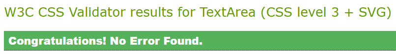
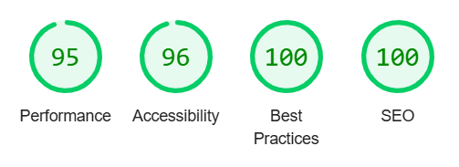
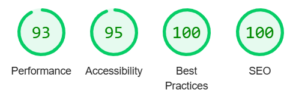
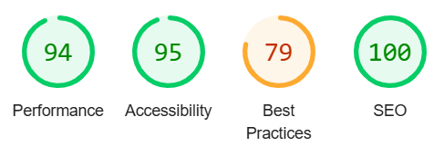
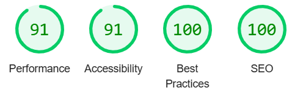
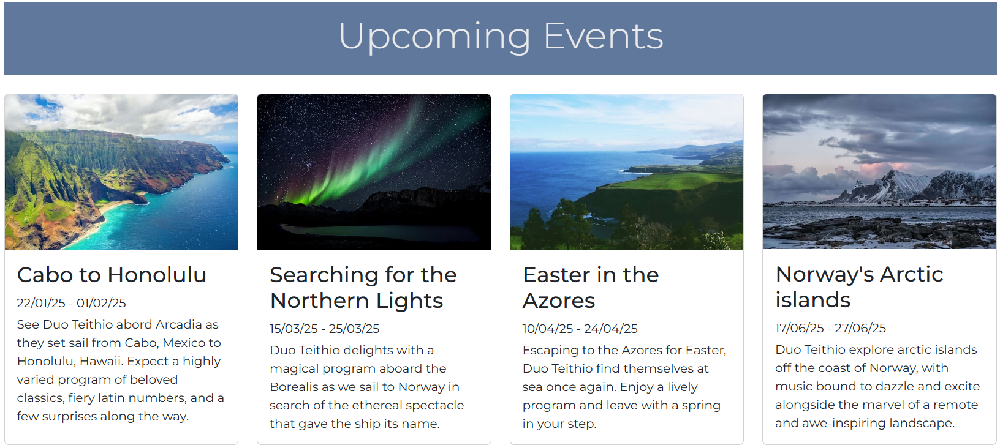
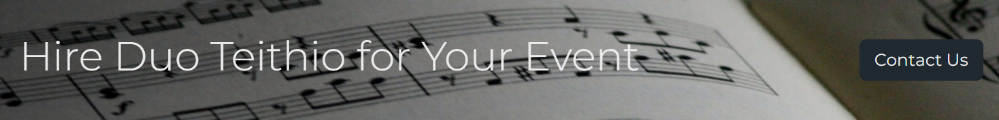
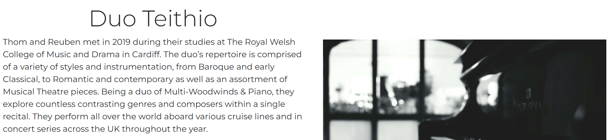
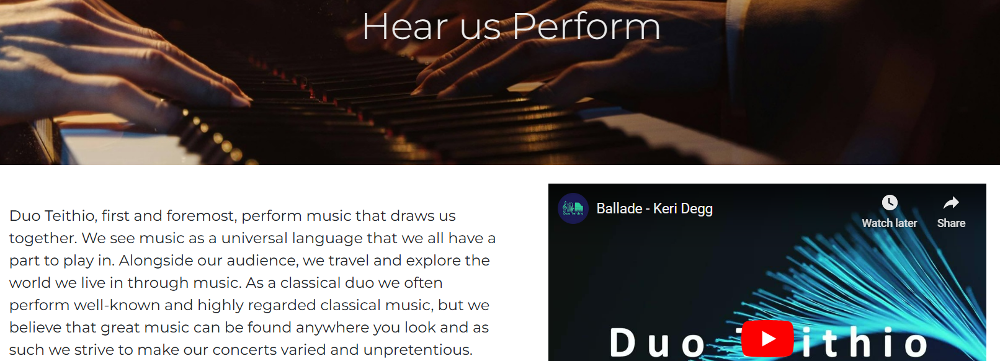

<h1 align="center">Duo Teithio Website</h1>

[Link to the live project](https://reubenstr0bel.github.io/Duo-Teithio-Website/index.html)

Duo Teithio is a classical ensemble of two members who need a website to communicate information with audience members and provide a method to enquire about bookings. Potential clients will be able to view biographical information, a gallery of performance recordings, and sign up to a newsletter. For organisations such as concert venues or booking agents, the website should showcase the duo's performance style, professionalism, and performance experience. 

(Add image of final webpage on various screen sizes)

## User Experience (UX)

### User stories

#### Audience Member Goals
  1. Easily find information about upcoming concerts
  2. Be able to sign up to a newsletter

#### Client Goals
  1. Easily navigate to a booking enquiry form
  2. View biographical information including performance history
  3. View recorded performances to assess suitability of duo for hire

## Pages and Features
### Universal Features

  * Navigation bar: featured at the top on all pages. Has hover and active link effects to make it clear which page the user is on or clicking onto. On smaller page sizes the nav bar changes to feature a burger icon with a drop down menu. The nav bar sticks to the top of the screen when scrolled so that the navigation elements are always accessible.
  * Footer: The footer features links to social media pages for the duo. The facebook link goes to the generic Facebook homepage as there is no Duo Teithio home page currently. These external links open in a new tab for improved user experience.
  * Error 404 page: A page to display in case a URL is typed incorrectly that will redirect the user to important sections of the website.

### Home Page 

  * Hero image: Catches the user's eye and immediately introduces the two members of the duo to the user, making it clear what the website is about.
  * Biography section: A section with a brief biography of the duo, introducing the most important aspects of the duo's performance style.
  * Upcoming Events section: A section to show information about future events or concerts, displayed in cards with a responsive layout. If the duo wanted to allow for event booking on their page or link to a website selling concert tickets a button could be included on this card.
  * Call to Action: A small section with a background image spanning the whole width of the page to draw attention. This acts as a call to action to visit the booking enquiries page.
  * Mailing List section: A form to join the Duo Teithio mailing list. This form redirects the user to a confirmation page once completed.

### Biography Page

  * Individual biographies: Some text giving biographical details of each musician and their experience and training.
  * Individual pictures: Images in the same style as the header but of each musician separately.

### Recordings page

  * Recording gallery: Videos of live performances given by the duo. These videos will also link to the duo's YouTube channel.

### Booking Enquiries page

  * Contact form: a form to submit an enquiry to hire the duo. This links to a confirmation page when completed.

## Design
### Colour Scheme
  
  This colour scheme was chosen to compliment the main hero image and work with a metallic gold colour to be used as a highlight.
### Typography
  The Montserrat font is used throughout the website. It is modern and stylish while still being easy to read at smaller sizes. Sans Serif is used as a fall back in case of issues with importing the font into the site.
### Imagery
  The main hero image is of Duo Teithio with a gold background and images throughout convey a sense of sophistication as well as showcasing the various instruments played by the duo.

### Wireframes

  * [Home Page](https://github.com/ReubenStr0bel/Duo-Teithio-Website/blob/main/readme_assets/images/index_wireframe.png)
  * [Biography Page](https://github.com/ReubenStr0bel/Duo-Teithio-Website/blob/main/readme_assets/images/biography_wireframe.png)
  * [Recordings Page](https://github.com/ReubenStr0bel/Duo-Teithio-Website/blob/main/readme_assets/images/recordings_wireframe.png)
  * [Booking Enquiries Page](https://github.com/ReubenStr0bel/Duo-Teithio-Website/blob/main/readme_assets/images/contact_wireframe.png)

## Technologies Used

  ### Languages Used

  *   [HTML5](https://en.wikipedia.org/wiki/HTML5)
  *   [CSS3](https://en.wikipedia.org/wiki/Cascading_Style_Sheets)

  ### Frameworks, Libraries & Programs Used
  
  * Bootstrap V5.3
  * GitHub and GitPod for development
  * GitHub Pages for deployment
  * Coolors.co to help generate the colour scheme
  * Pexels.com to source some of the images used (credited within the code)
  * Favicon.io to generate the favicon
  

## Testing
  ### Code Validation
  [W3C CSS Validator](https://jigsaw.w3.org/css-validator/#validate_by_input)

  

  [W3C HTML Validator](https://validator.w3.org/)
  | Page | Result |
  |------|--------|
  | Home Page | No errors or warnings |
  | Biography Page | No errors or warnings |
  | Recordings Page | Fixed: removed frameborder attribute from iframes as this is obsolete, changed sections to divs as the title is in a separate section from the content and as such the second section had no heading. No errors or warnings when tested after changes. |
  | Booking Enquiries Page | No errors or warnings |
  | Form Confirmation Page | No errors or warnings |
  | Error 404 Page | No errors or warnings |
  
  ### Performance
  #### Home Page
  
  #### Biography Page
  
  #### Recordings Page
  
  
  The best practices rating for this page leave a little to be desired. The reason for the low score is that including iframes to YouTube causes the use of cookies from YouTube's site, leading to a low rating. Iframes were chosen over including the videos on the site itself due to the large file size of the videos.
  #### Booking Enquiry Page
  
 
  ### Responsiveness

  The following devices were tested for responsiveness:
  | Device            | Notes      |
  |-------------------|------------|
  | iPhone 12 Pro     | Display of text on some pages, particularly on the biography page, gets a little bit too long on the small screen size |
  | iPhone 14 Pro Max | Same as above |
  | Galaxy S20 Ultra  | Same as above |
  | iPad air          | Fixed: Images weren't displaying in the center of the page at this screen size on the biography page |
  | iPad Pro          | Fixed: The image in the home page biography section was too small, with text displaying in a very narrow portion of the screen. I adjusted the bootstrap column classes to change at an xl screen size instead of lg |
  | Desktop 1280px    | No issues |
  | Desktop 1920px    | No Issues |

  ### User Stories
  #### Audience Member Goals
  1. Easily find information about upcoming concerts

  
  This section on the home page includes details of upcoming concerts and cruises. This could be improved by having links to separate pages for each event with further info and booking capabilities.
  
  2. Be able to sign up to a newsletter

  

  #### Client Goals
  1. Easily navigate to a booking enquiry form

  
  In addition to the nav bar at the top of the page, this section acts as a call to action to direct the user to the booking enquiry page.
  
  2. View biographical information including performance history

  
  In addition to individual biographies of each performer on the biography page, this section of the home page includes information about the performance history and style of the ensemble.
  
  3. View recorded performances to assess suitability of duo for hire

  
  In addition to videos of performances, this page includes information about the style of music performed by the duo. In the future this could also include professional recordings.

### Known Bugs
* Images not displaying correctly on deployed version

## Deployment

  ### GitHub Pages
  The website was deployed to GitHub Pages using the following steps:
  1. Navigate to the Duo Teithio repository
  2. Go to the settings tab (right hand side of the menu)
  3. Under 'Code and automation' click 'Pages' at the bottom
  4. Under 'Build and deployment' select 'Deploy from a branch' as the source
  5. Under 'Branch' select 'Main' and set the folder to '/root' then save

## Credits

  ### Code
  I frequently referenced documentation from Bootstrap v5.3 and included a number of Bootstrap elements in my code. These are referenced with comments. I also referred to documentation from W3Schools for both my HTML and CSS code to ensure I used correct syntax.

  ### Content
  Content was written by the members of Duo Teithio.

  ### Media
  Apart from images of the duo all images come from Pexels.com, with sources attributed in the code.

  ### Acknowledgements
  Many thanks to the support of my mentor Spencer Barriball for his assistance and invaluable advice.